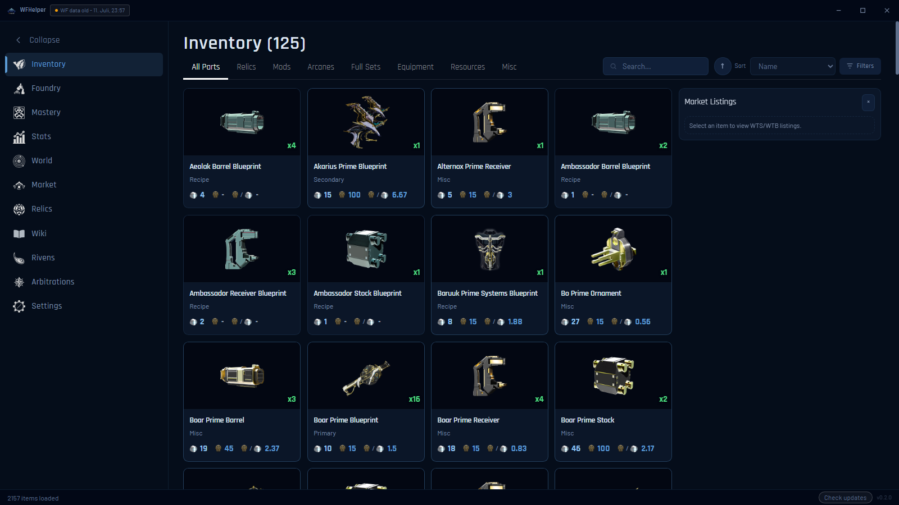

# WFHelper

[](https://github.com/WFHelper/WFHelper/releases/latest)

Unofficial Warframe companion app for Windows. Reads your inventory, prices it
with live warframe.market data, scans relic rewards on screen and tracks your
arbitration runs straight from EE.log.

**[wfhelper.com](https://wfhelper.com)** — download, the full feature tour, and FAQ.



<sub>Shown in the midnight-blue theme — 10 are built in, or build your own.</sub>

## Features

In the app:

- **Inventory** - full account inventory with platinum prices, order books and
  an equipment tab for weapons and frames
- **Relics** - browse owned relics with contents, drop sources and rewards
- **Foundry** - crafting requirements with full component trees
- **Mastery** - what you have not mastered yet, and what you could build
- **Rivens** - your rivens with market comparison and a riven finder
- **Market** - manage your warframe.market orders in-app (sign-in optional)
- **Arbitrations** - automatic per-run analysis from EE.log: kills, drones,
  rotations and vitus luck vs. the expected drop model, plus the schedule with
  Windows notifications for favorited nodes
- **World** - cycles, fissures, invasions, bounties and circuit rotations
- **Stats** - daily platinum/credits/endo tracking and trade history
- **Wiki** - item drop locations and relic reward tables
- **Themes** - preset looks or build your own

In-game overlays (Warframe in Borderless mode):

- **Relic rewards** - prices every reward when your squad's relics crack
- **Relic planner** - ranks your owned relics on the relic selection screen
- **Riven scanner** - reads rolls and compares old vs. new stats while rerolling
- **Arbitration summary** - your run stats the moment the mission ends

Notifications: in-game whispers, warframe.market DMs and arbitration windows can
raise Windows notifications while you play.

## Install

Download the latest `WFHelper-<version>-Setup.exe` from
[Releases](https://github.com/WFHelper/WFHelper/releases) and run it.

Windows SmartScreen may warn on first run because the installer is not
code-signed: click "More info", then "Run anyway".

### Inventory data

The game client offers no local inventory API, so the first-run wizard offers
three sources:

- **warframe-api-helper** (recommended) - downloads
  [Sainan/warframe-api-helper](https://github.com/Sainan/warframe-api-helper)
  and loads its `inventory.json` snapshots while you play
- **JSON import** - open an existing `inventory.json` export
- **AlecaFrame import** - decrypts AlecaFrame's local `lastData.dat` cache

## Privacy

Inventory snapshots, captured arbitration logs and stats stay on your PC. The
app talks to its own caching backend for warframe.market prices and icons, the
public game-data sources listed below, and GitHub for updates. No crash
reporting or telemetry is built into the app. Backend requests produce route,
status, timing and item-slug observability records in Cloudflare/Grafana.
Overlay windows also request the Rajdhani and Barlow fonts from Google Fonts.
Update checks are manual.

## Building from source

Requires Node 22+ and pnpm 11 (via corepack).

```
corepack enable
pnpm install --frozen-lockfile
pnpm run dev        # dev loop
pnpm run dist:win   # build the NSIS installer
```

## Credits

- [warframe.market](https://warframe.market) - prices and order data
- Digital Extremes' Public Export - item data and images
- [WFCD](https://github.com/WFCD) community projects - item database
  ([warframe-items](https://github.com/WFCD/warframe-items)), drop tables
  ([drops.warframestat.us](https://drops.warframestat.us)) and world-state API
- [browse.wf](https://browse.wf) - supplemental item icons
- [svesk's arbi analyzer](https://svesk.github.io/arbi/) - the arbitration
  stats model this app's analyzer is ported from
- [Sainan/warframe-api-helper](https://github.com/Sainan/warframe-api-helper) -
  inventory snapshot tool
- AlecaFrame - `lastData.dat` import compatibility

## Disclaimer

Unofficial fan project, not affiliated with or endorsed by Digital
Extremes. "Warframe" and related assets are property of Digital Extremes
Ltd.

## License

[MIT](LICENSE)
