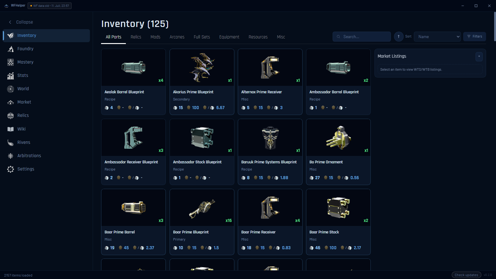

# WFHelper

Unofficial Warframe companion app for Windows and Linux. It reads your
inventory, prices it with live warframe.market data, scans relic rewards on
screen and tracks your arbitration runs straight from EE.log.

**[wfhelper.com](https://wfhelper.com)**: download, the full feature tour, and FAQ.



<sub>Shown in the midnight-blue theme. 16 themes are built in, or build your own.</sub>

## Features

In the app:

- Inventory: your whole account with platinum prices, order books and an
  equipment tab for weapons and frames
- Relics: the relics you own with their contents, drop sources and rewards
- Foundry: crafting requirements down to every component
- Mastery: what you have not mastered yet, and what you could build
- Rivens: your rivens compared with the market, plus a riven finder
- Market: manage your warframe.market orders in the app (sign-in optional)
- Arbitrations: each run analyzed from EE.log (kills, drones, rotations and
  vitus luck against the expected drop rates), plus the schedule with desktop
  notifications for favorited nodes
- World: cycles, fissures, invasions, bounties and circuit rotations
- Stats: daily platinum, credits and endo, plus your trade history
- Wiki: item drop locations and relic reward tables
- Themes: preset looks, or build your own

In-game overlays (Warframe in Borderless mode):

- Relic rewards: prices every reward when your squad's relics crack
- Relic planner: ranks the relics you own on the relic selection screen
- Riven scanner: reads the rolls and compares old and new stats while you reroll
- Arbitration summary: your run stats as soon as the mission ends

Notifications: in-game whispers, warframe.market DMs and arbitration windows can
show desktop notifications while you play.

> **Set Warframe's interface language to English.** Relic and riven scans only
> read English item names. WFHelper's own display language is separate and can
> be changed in Settings.

## Install

Download the latest `WFHelper-<version>-Setup.exe` from
[Releases](https://github.com/WFHelper/WFHelper/releases) and run it.

Windows SmartScreen may warn you the first time because the installer is not
code-signed: click "More info", then "Run anyway".

### Linux

Download `WFHelper-<version>.AppImage` from
[Releases](https://github.com/WFHelper/WFHelper/releases), make it executable
and run it:

```
chmod +x WFHelper-*.AppImage
./WFHelper-*.AppImage
```

In a file manager instead: right-click the file, open Properties, then
Permissions, tick "Allow executing as program" and double-click it.

Good to know:

- **Warframe runs through Steam (Proton).** WFHelper finds the game's log
  inside the Proton prefix on its own, including Flatpak and Snap Steam
  installs.
- **Inventory comes straight from the running game.** Nothing extra to
  download on Linux.
- **Wayland picks its own backend.** The app puts itself on XWayland so the overlays
  can sit on top of the game. Compositors without a real XWayland (niri) show
  no window at all, so WFHelper notices, restarts on native Wayland and
  remembers it. Settings lets you pick the backend by hand. Wayland gives no
  app a way to force itself above another, so overlays are best-effort there.
- **Native Wayland has no global hotkeys.** The overlay unlock key never fires
  there, so use "Switch to interactive overlays" in Settings > Overlays, or bind
  `--toggle-overlay-interaction` to a key in your compositor. In niri:
  `Mod+I { spawn "/path/to/WFHelper.AppImage" "--toggle-overlay-interaction"; }`
- **SteamOS is untested.** Desktop mode may work like any other distro. Game
  mode is not supported: gamescope only displays the game it launched, so
  forcing the app into it can freeze the session.
- **Screen capture mostly needs no dialog.** On XWayland WFHelper captures
  through X11. As a native Wayland app on sway, Hyprland, river and niri it
  copies the screen straight from the compositor. On KDE Plasma and COSMIC
  under native Wayland the first overlay scan opens the screen-share dialog
  once per session. Pick the monitor Warframe runs on.
- **Instant overlays need one launch option.** Add `PROTON_LOG=1 %command%` to
  Warframe's launch options (in Steam: right-click Warframe, Properties,
  Launch Options) and restart the game. The setup wizard shows the same string
  with a copy button. Without it the overlays still fire, just a few seconds
  later.

### Linux requirements

- **AppImage on Ubuntu 24.04 or newer:** install `libfuse2t64` and start the
  AppImage with `--no-sandbox` (Ubuntu's AppArmor blocks Electron's sandbox).
- **Reward and planner scans on XWayland:** nothing to install, WFHelper
  captures through X11.
- **Reward and planner scans on native Wayland:**
  - sway, Hyprland, river and niri: nothing to install, WFHelper copies the
    screen straight from the compositor. If you turned on Hyprland's permission
    prompts, allow screen copy for WFHelper.
  - KDE Plasma and COSMIC: scans go through the desktop's screen-share portal.
    Install `xdg-desktop-portal-kde` (KDE Plasma) or `xdg-desktop-portal-cosmic`
    (COSMIC) and log out and back in. To check it, start a PipeWire screen
    capture in OBS or share your screen in a browser: a share dialog should
    open. **Settings > Overlays > Set up screen capture** opens that dialog
    before you play, so it does not hide behind the game on the first reward
    screen.
  - GNOME has no layer-shell overlays, so keep WFHelper on XWayland there.
- **Saving your warframe.market login needs a keyring:** gnome-keyring, KWallet
  or KeePassXC with Secret Service turned on. WFHelper uses it on its own when
  one is running. If you still have to sign in after every restart, start
  WFHelper with `--password-store=gnome-libsecret` (or
  `--password-store=kwallet6` on KDE).

### Inventory data

The game has no local inventory API, so the first-run wizard offers three
sources:

- warframe-api-helper (recommended): on Windows it downloads
  [Sainan/warframe-api-helper](https://github.com/Sainan/warframe-api-helper)
  and loads its `inventory.json` snapshots while you play. On Linux this option
  is called "Read from the running game": WFHelper takes the login token from
  the running game and downloads your inventory itself
- JSON import: open an `inventory.json` export you already have
- AlecaFrame import: decrypts AlecaFrame's local `lastData.dat` cache

You can also pick "Continue without inventory". World and the warframe.market
features work without one; everything based on what you own needs an
inventory, which you can connect later in Settings.

## Privacy

Inventory snapshots, captured arbitration logs and stats stay on your PC. The
app talks to its own caching backend for warframe.market prices and icons, to
the public game-data sources listed below, and to GitHub for updates. The app
has no crash reporting or telemetry. Each backend request leaves a record of
its route, status, timing and item slug in Cloudflare and Grafana, and the
backend keeps an anonymous count of daily active users.
The installed app checks for updates when it starts and every 6 hours; you
choose when to download and install one.

## Building from source

You need Node 22.12 or newer and pnpm 11 (through corepack).

```
corepack enable
pnpm install --frozen-lockfile
pnpm run dev        # run in development
pnpm run dist:win   # build the Windows installer (NSIS)
```

## Credits

- [warframe.market](https://warframe.market): prices and order data
- Digital Extremes' Public Export: item data and images
- [WFCD](https://github.com/WFCD) community projects: the item database
  ([warframe-items](https://github.com/WFCD/warframe-items)), drop tables
  ([drops.warframestat.us](https://drops.warframestat.us)) and the world-state API
- [browse.wf](https://browse.wf): extra item icons
- [sves' arbi analyzer](https://svesk.github.io/arbi/): the arbitration stats
  model this app's analyzer is ported from
- [Sainan/warframe-api-helper](https://github.com/Sainan/warframe-api-helper):
  the inventory snapshot tool
- AlecaFrame: the `lastData.dat` format the import reads

## Support

WFHelper is free and open source, with no ads or accounts. If it saves you
plat, [Patreon](https://www.patreon.com/WFHelper) helps pay for the Cloudflare
hosting it runs on. Supporters get a Discord role and a thank-you in the app.

## Disclaimer

Unofficial fan project, not affiliated with or endorsed by Digital
Extremes. "Warframe" and related assets are property of Digital Extremes
Ltd.

## License

[MIT](LICENSE). The bundled Barlow and Rajdhani fonts in `renderer/fonts/` are
licensed under the SIL Open Font License 1.1.
